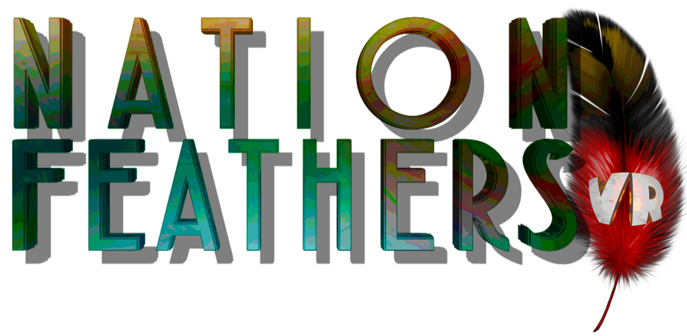

**Nation Feathers VR** is a mobile VR learning game for identifying bird
vocalizations developed with Unity in 2017 in
the context of a [bachelor thesis](bachelor_thesis.png) at the [Cornell Lab of
Ornithology](https://www.birds.cornell.edu/home/).

Watch a
[demo](https://forstudents-my.sharepoint.com/:v:/g/personal/ge29yak_forstudents_onmicrosoft_com/EXS5D1gR_hZPioSt2b_dhN4BKyewkHXU5HDJOPgRuLANSQ?e=0mhXzE)
🎬

Download the game
[file](https://forstudents-my.sharepoint.com/:u:/g/personal/ge29yak_forstudents_onmicrosoft_com/EYpnBCi9MrFMgkTVzEK0JAEBDvnX4CsIrBl6c1ELHoL0pg?e=WIgcdp)
(.apk) 🕹️
